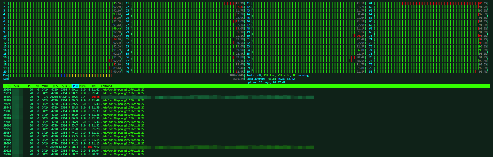

# defcon26-pow

Same proof, less work.

This pow solver has been used by krautstrike instead of the slow python script.
A pow-as-a-service deployment has been provided by tu-berlin and [@domenukk].

[@domenukk]: https://github.com/domenukk

Make sure you build a release binary with `cargo build --release`.

[](image.png)

## Tests

```
$ cargo test
```

## Benchmarks

```
$ cargo +nightly bench --features=nightly
running 5 tests
test tests::test_check_pow_invalid ... ignored
test tests::test_check_pow_valid ... ignored
test tests::test_pow_hash ... ignored
test tests::bench_pow_hash  ... bench:         411 ns/iter (+/- 92)
test tests::bench_pow_valid ... bench:       1,459 ns/iter (+/- 223)

test result: ok. 0 passed; 0 failed; 3 ignored; 2 measured; 0 filtered out
$
```
